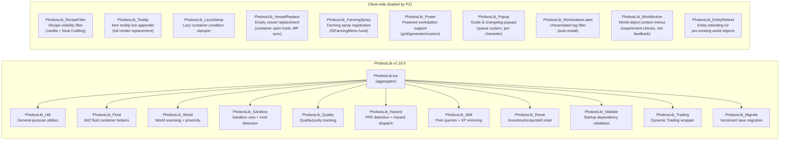

<!--
  ________________________________________________________________________
 / Copyright (c) 2026 Phobos A. D'thorga                                \
 |                                                                        |
 |           /\_/\                                                         |
 |         =/ o o \=    Phobos' PZ Modding                                |
 |          (  V  )     All rights reserved.                              |
 |     /\  / \   / \                                                      |
 |    /  \/   '-'   \   This source code is part of the Phobos            |
 |   /  /  \  ^  /\  \  mod suite for Project Zomboid (Build 42).         |
 |  (__/    \_/ \/  \__)                                                  |
 |     |   | |  | |     Unauthorised copying, modification, or            |
 |     |___|_|  |_|     distribution of this file is prohibited.          |
 |                                                                        |
 \________________________________________________________________________/
-->

# PhobosLib Module Overview & API Reference

PhobosLib v1.18.0 provides 22 modules (13 shared + 11 client/server) loaded via `require "PhobosLib"` plus PZ's automatic client/ and server/ loading.

## Module Architecture


```mermaid
graph LR
    subgraph LIB["PhobosLib v1.18.0"]
        INIT["PhobosLib.lua<br/>(aggregator)"]

        UTIL["PhobosLib_Util<br/>General-purpose utilities"]
        FLUID["PhobosLib_Fluid<br/>B42 fluid container helpers"]
        WORLD["PhobosLib_World<br/>World scanning + proximity"]
        SANDBOX["PhobosLib_Sandbox<br/>Sandbox vars + mod detection"]
        QUALITY["PhobosLib_Quality<br/>Quality/purity tracking"]
        HAZARD["PhobosLib_Hazard<br/>PPE detection + hazard dispatch"]
        SKILL["PhobosLib_Skill<br/>Perk queries + XP mirroring"]
        RESET["PhobosLib_Reset<br/>Inventory/recipe/skill reset"]
        VALIDATE["PhobosLib_Validate<br/>Startup dependency validation"]
        TRADING["PhobosLib_Trading<br/>Dynamic Trading wrapper"]
        MIGRATE["PhobosLib_Migrate<br/>Versioned save migration"]
    end

    subgraph CLIENT["Client-side (loaded by PZ)"]
        RF["PhobosLib_RecipeFilter<br/>Recipe visibility filter<br/>(vanilla + Neat Crafting)"]
        TT["PhobosLib_Tooltip<br/>Item tooltip line appender<br/>(full render replacement)"]
        LS["PhobosLib_LazyStamp<br/>Lazy container condition stamper"]
        VR["PhobosLib_VesselReplace<br/>Empty vessel replacement<br/>(container open hook, MP sync)"]
        FS["PhobosLib_FarmingSpray<br/>Farming spray registration<br/>(ISFarmingMenu hook)"]
        PW["PhobosLib_Power<br/>Powered workstation support<br/>(grid/generator/custom)"]
        PP["PhobosLib_Popup<br/>Guide & changelog popups<br/>(queue system, per-character)"]
        WL["PhobosLib_WorkstationLabel<br/>Untranslated tag filter<br/>(auto-install)"]
        WA["PhobosLib_WorldAction<br/>World object context menus<br/>(requirement checks, red feedback)"]
        ER["PhobosLib_EntityRebind<br/>Entity rebinding for<br/>pre-existing world objects"]
    end

    INIT --> UTIL
    INIT --> FLUID
    INIT --> WORLD
    INIT --> SANDBOX
    INIT --> QUALITY
    INIT --> HAZARD
    INIT --> SKILL
    INIT --> RESET
    INIT --> VALIDATE
    INIT --> TRADING
    INIT --> MIGRATE
```

> The 13 shared modules load into the global `PhobosLib` table via `require "PhobosLib"`. The 11 client/server-side modules (RecipeFilter, Tooltip, LazyStamp, VesselReplace, FarmingSpray, Power, Popup, WorkstationLabel, WorldAction, EntityRebind) are loaded separately by PZ from `client/` and `server/` and also attach to the `PhobosLib` table.

---

## PhobosLib_Util

General-purpose utilities: safe method calling, API probing, keyword-based item search, modData helpers, and player speech bubbles.

| Function | Parameters | Description |
|----------|-----------|-------------|
| `lower(s)` | `s: string` | Safe lowercase conversion; returns `""` for nil/non-string |
| `pcallMethod(obj, methodName, ...)` | `obj, methodName, ...args` | Safe method call via pcall; returns `ok, result` |
| `probeMethod(obj, methodNames)` | `obj, methodNames: table` | Try multiple method names; returns first numeric result |
| `probeMethodAny(obj, methodNames)` | `obj, methodNames: table` | Try multiple method names; returns first non-nil result |
| `matchesKeywords(item, keywords)` | `item, keywords: table` | Check if item's fullType or displayName contains any keyword |
| `findItemByKeywords(inventory, keywords)` | `inventory, keywords: table` | Find first matching item in an inventory |
| `findAllItemsByKeywords(inventory, keywords)` | `inventory, keywords: table` | Find all matching items in an inventory |
| `findItemByFullType(inventory, fullType)` | `inventory, fullType: string` | Find item by exact fullType |
| `findAllItemsByFullType(inventory, fullType)` | `inventory, fullType: string` | Find all items matching exact fullType |
| `say(player, msg)` | `player, msg: string` | Safe player speech bubble; no-op if unavailable |
| `getItemWeight(item)` | `item` | Safe weight getter; probes getActualWeight then getWeight |
| `getItemUseDelta(item)` | `item` | Safe UseDelta getter for Drainable items |
| `setItemUseDelta(item, value)` | `item, value: number` | Safe UseDelta setter; clamps to [0, 1] |
| `refundItems(items, player)` | `items: ArrayList, player` | Re-add consumed recipe items to player inventory |
| `getItemCondition(item)` | `item` | Safe item condition getter |
| `setItemCondition(item, value)` | `item, value: number` | Safe item condition setter |
| `getModData(item)` | `item` | Safe modData table getter; returns table or nil |
| `getModDataValue(item, key, default)` | `item, key: string, default` | Read single modData value with fallback |
| `setModDataValue(item, key, value)` | `item, key: string, value` | Write single modData value; returns true on success |
| `getConditionPercent(item)` | `item` | Get item condition as normalised 0-100 percentage regardless of ConditionMax |
| `setConditionPercent(item, pct)` | `item, pct: number` | Set item condition from a 0-100 percentage, scaled to the item's ConditionMax |

---

## PhobosLib_Fluid

Build 42 fluid container helpers with multi-strategy API fallbacks.

| Function | Parameters | Description |
|----------|-----------|-------------|
| `tryGetFluidContainer(item)` | `item` | Get fluid container from an item; tries multiple method names |
| `tryGetCapacity(fc)` | `fc: FluidContainer` | Probe container capacity in litres |
| `tryGetAmount(fc)` | `fc: FluidContainer` | Probe current fluid amount in litres |
| `tryAddFluid(fc, fluidType, liters)` | `fc, fluidType/string, liters: number` | Add fluid using multiple strategies; resolves FluidType strings to objects |
| `tryDrainFluid(fc, liters)` | `fc, liters: number` | Drain/remove fluid from container |
| `findEmptyFluidContainer(player, validTypes)` | `player, validTypes: table` | Find an empty FluidContainer item in the player's inventory matching a list of valid item fullTypes |
| `tryGetFluidName(fc)` | `fc: FluidContainer` | Safely retrieve the fluid type name string from a FluidContainer |
| `stampFluidContainerQuality(item, qualityPercent)` | `item, qualityPercent: number` | Stamp condition-based purity on a filled FluidContainer after `+fluid` output |
| `recoverDrainedFluidQuality(item)` | `item` | Recover purity value from a FluidContainer after `-fluid` drain for downstream recipe chaining |

---

## PhobosLib_World

World scanning: tile iteration, object keyword search, generator detection, vehicle proximity.

| Function | Parameters | Description |
|----------|-----------|-------------|
| `getSquareFromPlayer(player)` | `player` | Safely get the IsoGridSquare a player is on |
| `scanNearbySquares(originSquare, radius, callback)` | `square, radius: number, callback: function` | Iterate all grid squares within radius |
| `findNearbyObjectByKeywords(originSquare, radius, keywords)` | `square, radius, keywords: table` | Find first matching IsoObject nearby |
| `findAllNearbyObjectsByKeywords(originSquare, radius, keywords)` | `square, radius, keywords: table` | Find all matching IsoObjects nearby |
| `isNearObjectType(player, radius, keywords)` | `player, radius, keywords: table` | Boolean: is player near a matching object? |
| `findNearbyGenerator(square, radius)` | `square, radius: number` | Find an active IsoGenerator nearby |
| `findAnyNearbyGenerator(square, radius)` | `square, radius: number` | Find any IsoGenerator nearby (running or not) |
| `findNearbyVehicle(player, radius)` | `player, radius: number` | Find nearest vehicle within radius |
| `isVehicleRunning(vehicle)` | `vehicle` | Safe check if vehicle engine is running |

---

## PhobosLib_Sandbox

Safe sandbox variable access, runtime mod detection, and yield scaling.

| Function | Parameters | Description |
|----------|-----------|-------------|
| `getSandboxVar(modId, varName, default)` | `modId, varName: string, default` | Retrieve sandbox variable with fallback |
| `isModActive(modId)` | `modId: string` | Check if a mod is in the active mod list |
| `applyYieldMultiplier(baseAmount, modId, varName)` | `baseAmount: number, modId, varName: string` | Scale amount by a sandbox multiplier variable |
| `setSandboxVar(modId, varName, value)` | `modId, varName: string, value` | Set a sandbox variable value (for one-shot auto-reset) |
| `consumeSandboxFlag(modId, varName)` | `modId, varName: string` | Clear sandbox flag in-memory AND persist to world modData for restart survival |
| `reapplyConsumedFlags()` | *(none)* | Re-apply consumed flags from world modData on game start (auto-registered via OnGameStart) |
| `createCallbackTable(name)` | `name: string` | **DEPRECATED v1.5.0** — craftRecipe OnTest is execution-only, not visibility. Use `registerRecipeFilter()` instead |
| `registerOnTest(tableName, funcName, func)` | `tableName, funcName: string, func: function` | **DEPRECATED v1.5.0** — craftRecipe OnTest is execution-only, not visibility. Use `registerRecipeFilter()` instead |

---

## PhobosLib_Quality

Generic quality/purity tracking: 0-100 scoring, tier lookup, equipment factors, severity scaling.

| Function | Parameters | Description |
|----------|-----------|-------------|
| `getQuality(item, key, default)` | `item, key: string, default: number` | Read quality value from item modData |
| `setQuality(item, key, value)` | `item, key: string, value: number` | Write clamped 0-100 quality value |
| `getQualityTier(value, tiers)` | `value: number, tiers: table` | Look up tier name and RGB colour |
| `averageInputQuality(items, key, default)` | `items: ArrayList, key, default` | Average quality across recipe inputs |
| `calculateOutputQuality(inputQuality, factor, variance)` | `input, factor, variance: number` | Calculate output quality with equipment factor |
| `randomBaseQuality(min, max)` | `min, max: number` | Generate random base quality for source recipes |
| `adjustFactorBySeverity(factor, severity)` | `factor, severity: number` | Adjust equipment factor by severity setting |
| `announceQuality(player, value, tiers, prefix)` | `player, value, tiers, prefix` | Speech bubble showing quality tier |
| `getQualityYield(value, yieldTable)` | `value: number, yieldTable: table` | Look up yield multiplier from quality |
| `applyFluidQualityPenalty(result, value, yieldTable)` | `result, value, yieldTable` | Drain fluid based on quality penalty |
| `removeExcessItems(player, itemType, baseCount, keepCount)` | `player, itemType, base, keep` | Remove excess items for yield penalties |
| `stampAllOutputs(player, resultType, key, value)` | `player, resultType, key, value` | Stamp quality on all unstamped outputs |

---

## PhobosLib_Hazard

PPE detection, respiratory protection assessment, mask filter degradation, EHR disease dispatch with vanilla stat fallback.

| Function | Parameters | Description |
|----------|-----------|-------------|
| `findWornItem(player, itemTypes)` | `player, itemTypes: table` | Scan worn items for matching full type |
| `getRespiratoryProtection(player)` | `player` | Returns `{hasMask, hasFilter, maskItem, protectionLevel}` |
| `degradeFilterFromInputs(items, maskTypes, amount)` | `items: ArrayList, maskTypes: table, amount: number` | Degrade mask filter found in recipe inputs |
| `isEHRActive()` | *(none)* | Check if EHR mod is active with disease system enabled |
| `applyHazardEffect(player, config)` | `player, config: table` | Dispatch EHR disease or vanilla stat penalties |
| `warnHazard(player, msg)` | `player, msg: string` | Speech bubble warning about hazard exposure |

### `applyHazardEffect` Config Table

| Field | Type | Description |
|-------|------|-------------|
| `ehrDisease` | string | EHR disease ID (e.g., `"corpse_sickness"`) |
| `ehrChance` | number | Base chance 0.0-1.0 |
| `ehrSevereDisease` | string? | Rare severe disease (e.g., `"pneumonia"`) |
| `ehrSevereChance` | number? | Chance for severe outcome |
| `vanillaSickness` | number | Vanilla SICKNESS stat delta |
| `vanillaPain` | number | Vanilla PAIN stat delta |
| `vanillaStress` | number | Vanilla STRESS stat delta |
| `protectionMultiplier` | number | 0.0-1.0, scales all chances |

---

## PhobosLib_Skill

Perk existence checks, safe XP queries and awards, one-shot XP mirroring, persistent cross-skill XP mirror registration.

| Function | Parameters | Description |
|----------|-----------|-------------|
| `perkExists(perkName)` | `perkName: string` | Check if a named perk exists in the Perks table |
| `getPerkLevel(player, perkEnum)` | `player, perkEnum` | Safe perk level query; returns 0-10 or 0 on failure |
| `addXP(player, perkEnum, amount)` | `player, perkEnum, amount: number` | Safe XP award; returns true on success |
| `getXP(player, perkEnum)` | `player, perkEnum` | Safe XP total query; returns 0 on failure |
| `mirrorXP(player, targetPerkEnum, amount, ratio)` | `player, target, amount, ratio: number` | One-shot XP mirror (no event hook) |
| `registerXPMirror(sourcePerkName, targetPerkName, ratio)` | `source, target: string, ratio: number` | Register persistent Events.AddXP mirror with reentrance guard |

---

## PhobosLib_Reset

Generic inventory/recipe/skill reset utilities for mod cleanup systems. Deep inventory traversal, modData stripping, recipe removal, XP reset, and item removal by module.

| Function | Parameters | Description |
|----------|-----------|-------------|
| `iterateInventoryDeep(player, callback)` | `player, callback: function` | Deep inventory traversal including nested containers (bags, backpacks), with visited-set loop guard |
| `stripModDataKey(player, key)` | `player, key: string` | Remove a specific modData key from all items (deep scan) |
| `forgetRecipesByPrefix(player, prefix)` | `player, prefix: string` | Two-pass recipe removal to avoid ConcurrentModificationException |
| `resetPerkXP(player, perkEnum)` | `player, perkEnum` | Multi-strategy XP reset (setXP → setPerkLevel → LoseLevel loop) |
| `removeItemsByModule(player, moduleId)` | `player, moduleId: string` | Remove all items belonging to a module, matching via getModule() or fullType prefix |
| `getWorldModDataValue(key, default)` | `key: string, default` | Read a value from the global world modData table with fallback |
| `stripWorldModDataKeys(prefix)` | `prefix: string` | Remove all world modData keys matching a prefix |

---

## PhobosLib_Validate

Startup dependency validation: register expected items, fluids, and perks at load time, then validate during OnGameStart. Missing entries are logged with the requesting mod ID.

| Function | Parameters | Description |
|----------|-----------|-------------|
| `expectItem(modId, fullType)` | `modId, fullType: string` | Register an expected item type to be verified at startup |
| `expectFluid(modId, fluidType)` | `modId, fluidType: string` | Register an expected fluid type to be verified at startup |
| `expectPerk(modId, perkName)` | `modId, perkName: string` | Register an expected perk to be verified at startup |
| `validateDependencies()` | *(none)* | Run all registered validations and log results; called automatically via OnGameStart |

### Usage Pattern

```lua
-- In your mod's shared/ init file (runs before OnGameStart):
local PL = require "PhobosLib"
PL.expectItem("MyMod", "Base.SomeItem")
PL.expectFluid("MyMod", "SomeFluid")
PL.expectPerk("MyMod", "SomePerk")

-- PhobosLib automatically calls validateDependencies() during OnGameStart.
-- Missing entries appear in console.txt as:
--   [PhobosLib:Validate] MISSING item 'Base.SomeItem' expected by MyMod
```

---

## PhobosLib_Trading

Generic wrapper for the Dynamic Trading mod (DynamicTradingCommon). All functions are no-ops when DynamicTrading is not installed. All DT calls are pcall-wrapped for safety if the mod is removed mid-save. Detection is lazy: the first call to any function checks whether the DynamicTrading global exists.

| Function | Parameters | Description |
|----------|-----------|-------------|
| `isDynamicTradingActive()` | *(none)* | Lazy runtime detection; returns `true` if DynamicTrading API is available |
| `registerTradeTag(tag, data)` | `tag: string, data: table` | Register a custom price/rarity tag; data = `{ priceMult = number, weight = number }` |
| `registerTradeArchetype(id, data)` | `id: string, data: table` | Register an NPC trader archetype; data = `{ name, allocations, wants, forbid }` |
| `registerTradeItems(list)` | `list: table` | Batch item registration; list = array of `{ item, basePrice, tags, stockRange }` — returns `ok, count` |
| `registerTradeItem(uniqueID, data)` | `uniqueID: string, data: table` | Single item registration; data = `{ item, basePrice, tags, stockRange }` |

### Usage Pattern

```lua
require "PhobosLib"

local function registerMyTradeData()
    if isClient() then return end
    if not PhobosLib.isDynamicTradingActive() then return end

    PhobosLib.registerTradeTag("MyTag", { priceMult = 1.5, weight = 20 })

    PhobosLib.registerTradeArchetype("MyMod_Trader", {
        name = "Specialist",
        allocations = { MyTag = 80, Common = 20 },
        wants = { MyTag = 1.3 },
        forbid = { "Illegal" },
    })

    PhobosLib.registerTradeItems({
        { item = "MyMod.ItemA", basePrice = 50, tags = { "MyTag", "Uncommon" }, stockRange = { min = 1, max = 3 } },
        { item = "MyMod.ItemB", basePrice = 20, tags = { "MyTag", "Common" }, stockRange = { min = 2, max = 6 } },
    })
end

Events.OnGameStart.Add(registerMyTradeData)
```

---

## PhobosLib_Migrate

Versioned save migration framework for mod upgrades. Tracks installed mod versions in world modData and executes registered migration functions exactly once per version transition. Uses guard keys (`PhobosLib_migration_<modId>_<toVersion>_done`) to prevent re-execution on reload.

| Function | Parameters | Description |
|----------|-----------|-------------|
| `compareVersions(v1, v2)` | `v1, v2: string` | Semantic version comparison; returns -1 (v1 < v2), 0 (equal), or 1 (v1 > v2) |
| `getInstalledVersion(modId)` | `modId: string` | Read mod version from world modData; returns nil for first install |
| `setInstalledVersion(modId, version)` | `modId, version: string` | Write mod version to world modData |
| `registerMigration(modId, from, to, fn, label)` | `modId: string, from: string?, to: string, fn: function, label: string` | Register a migration function; `from` is documentation-only (not used in execution logic); all migrations where `installed < to` run automatically; `fn(player)` returns `ok, msg` |
| `registerIncompatibleHandler(modId, handler)` | `modId: string, handler: function` | Register a callback for incompatible version states (downgrade or invalid version string). Handler receives `{modId, installed, currentVersion, reason, guardCount}` and returns `"skip"` (stamp, no migrations), `"reset"` (treat as 0.0.0, run all), or `"abort"` (do nothing). Sensible defaults used when no handler is registered (downgrade→skip, invalid→reset). |
| `runMigrations(modId, currentVersion, players)` | `modId, currentVersion: string, players: table` | Execute all pending migrations in version order; stamps version on completion; returns array of `{label, ok, msg, to, reason?}` results |
| `notifyMigrationResult(player, modId, result)` | `player, modId: string, result: table` | Send migration result to client via `sendServerCommand(modId, "migrateResult", result)`; includes optional `reason` field |

### Migration Outcomes (v1.9.0)

Three possible outcomes when `runMigrations` is called:

1. **Normal** — installed < currentVersion: run all pending migrations where `installed < mig.to`
2. **Recovery** — version stamped but no guard keys exist (v1.8.0 bug): reset to `"0.0.0"`, re-run all migrations
3. **Incompatible** — downgrade or invalid version string: invoke registered handler (or default), which returns `"skip"`, `"reset"`, or `"abort"`

Migration functions must be idempotent on empty state (safe to re-run on fresh installs).

### Usage Pattern

```lua
require "PhobosLib"

PhobosLib.registerMigration("MyMod", nil, "1.0.0", function(player)
    -- First install or pre-framework upgrade
    return true, "Initial setup complete."
end, "MyMod v1.0.0: Initial migration")

PhobosLib.registerMigration("MyMod", "1.0.0", "1.1.0", function(player)
    -- Upgrade from 1.0.0 to 1.1.0
    return true, "Upgraded data format."
end, "MyMod v1.1.0: Data format upgrade")

-- In your OnGameStart handler:
local results = PhobosLib.runMigrations("MyMod", "1.1.0", players)
for _, result in ipairs(results) do
    for _, player in ipairs(players) do
        PhobosLib.notifyMigrationResult(player, "MyMod", result)
    end
end
```

---

## PhobosLib_Debug

Centralised debug logging system. Mods call `PhobosLib.debug(modId, ...)` to print tagged log messages. Output is controlled per-mod via a `EnableDebugLogging` sandbox option — debug calls are no-ops when logging is disabled. Uses lazy per-mod caching to avoid repeated sandbox lookups.

| Function | Parameters | Description |
|----------|-----------|-------------|
| `debug(modId, ...)` | `modId: string, ...: any` | Print `[modId] ...` to console if EnableDebugLogging is true for the calling mod |

---

## PhobosLib_Fermentation

Fermentation registry and progress tracking for items that use B42's `ReplaceOnRotten` mechanic as a positive curing/fermentation trigger. Pure data module — no events, no hooks.

| Function | Parameters | Description |
|----------|-----------|-------------|
| `registerFermentation(fullType, config)` | `fullType: string, config: table` | Register an item as a positive-rot fermentation. `config = { label: string, totalHours: number, translationKey: string? }` |
| `isFermentationItem(fullType)` | `fullType: string` | Returns true if the item type is registered for fermentation |
| `getFermentationConfig(fullType)` | `fullType: string` | Returns the raw config table or nil |
| `getFermentationProgress(item)` | `item: InventoryItem` | Returns `{ percent: number, remainingHours: number, remainingDays: number, label: string, complete: boolean }` or nil if not a fermentation item. Uses `item:getAge()` vs `totalHours`. |
| `stampFermentationDate(item)` | `item: InventoryItem` | Write current game date to `item:getModData().PhobosLib_FermentStart` as `{y, m, d}` |
| `getFermentationDate(item)` | `item: InventoryItem` | Read the fermentation start date from modData; returns `{year, month, day}` (1-indexed month) or nil |
| `formatGameDate(dateTable)` | `dateTable: table` | Format `{year, month, day}` as short string e.g. `"Jul 12"` |

---

## PhobosLib_RecipeFilter

Client-side crafting menu recipe visibility filter. B42 `craftRecipe` `OnTest` is a server-side execution gate, NOT a UI visibility gate — `getOnAddToMenu()` returns nil for all craftRecipe objects. This module fills the gap by overriding the crafting UI to inject filter checks.

Supports three UI code paths:
- **Path 1**: Vanilla `ISRecipeScrollingListBox:addGroup()` (list view)
- **Path 2**: Vanilla `ISTiledIconPanel:setDataList()` (grid view)
- **Path 3**: Neat Crafting `NC_FilterBar:shouldIncludeRecipe()` — runtime-detected, installed immediately or deferred via `Events.OnGameStart`

> **Note**: This module lives in `client/` (not `shared/`) and is loaded automatically by PZ's client-side module loader, not by the PhobosLib aggregator.

| Function | Parameters | Description |
|----------|-----------|-------------|
| `registerRecipeFilter(recipeName, filterFunc)` | `recipeName: string, filterFunc: function` | Register a visibility filter for a single recipe; filter receives no args, returns `true` to show, `false` to hide |
| `registerRecipeFilters(filterTable)` | `filterTable: table` | Bulk-register from `{ ["RecipeName"] = filterFunc, ... }` table |
| `_checkRecipeFilter(recipeName)` | `recipeName: string` | Internal: check filter registry for a recipe name; pcall-wrapped, fail-open (returns `true` on error) |

### Usage Pattern

```lua
-- In your mod's client/ init file:
require "PhobosLib"

PhobosLib.registerRecipeFilter("MyModRecipeName", function()
    return SandboxVars.MyMod.EnableFeature
end)

-- Or bulk register:
PhobosLib.registerRecipeFilters({
    ["MyRecipeA"] = function() return SandboxVars.MyMod.OptionA end,
    ["MyRecipeB"] = function() return SandboxVars.MyMod.OptionB end,
})
```

---

## PhobosLib_Tooltip

Client-side generic tooltip line appender for item tooltips. Registers provider callbacks that append coloured text lines below the vanilla item tooltip for items matching a module prefix. Uses a full render replacement of `ISToolTipInv.render()` that replicates the vanilla render flow with expanded dimensions for provider lines. For items with no matching providers, delegates to the original render unchanged. Entire render block is pcall-wrapped for B42 API resilience.

> **Note**: This module lives in `client/` (not `shared/`) and is loaded automatically by PZ's client-side module loader, not by the PhobosLib aggregator.

| Function | Parameters | Description |
|----------|-----------|-------------|
| `registerTooltipProvider(modulePrefix, provider)` | `modulePrefix: string, provider: function` | Register a tooltip provider for items whose `fullType` contains the given prefix. The provider receives the hovered item and returns an array of `{text=string, r=number, g=number, b=number}` line tables (or nil to skip). Multiple providers can match the same item; lines are concatenated in registration order. |

### Usage Pattern

```lua
-- In your mod's client/ init file:
require "PhobosLib"

PhobosLib.registerTooltipProvider("MyMod.", function(item)
    local value = item:getCondition()
    return {{
        text = "Quality: " .. value .. "%",
        r = 0.4, g = 0.8, b = 1.0,
    }}
end)
```

---

## PhobosLib_LazyStamp

Client-side lazy container condition stamper. When the player opens or views a container, all items matching a registered module prefix that still have condition == ConditionMax (unstamped) are stamped to the configured value. Covers items in safehouse storage, vehicle trunks, and other world containers that server-side OnGameStart migrations cannot reach (because those cells may not be loaded).

Hooks `Events.OnRefreshInventoryWindowContainers` once on first registration. Runs only at the `"end"` stage when all containers are finalized. Optional guard function controls when stamping is active (e.g. sandbox option checks).

> **Note**: This module lives in `client/` (not `shared/`) and is loaded automatically by PZ's client-side module loader, not by the PhobosLib aggregator.

| Function | Parameters | Description |
|----------|-----------|-------------|
| `registerLazyConditionStamp(modulePrefix, stampValue, guardFunc)` | `modulePrefix: string, stampValue: number, guardFunc: function?` | Register a stamper for items whose `fullType` contains the given prefix. Items at condition == ConditionMax get stamped to `stampValue`. Optional `guardFunc` returns `true` to enable stamping (e.g. sandbox option check). |

### Usage Pattern

```lua
-- In your mod's client/ init file:
require "PhobosLib"

PhobosLib.registerLazyConditionStamp(
    "MyMod.",                            -- module prefix
    99,                                   -- stamp value
    function()                            -- optional guard
        return SandboxVars.MyMod.EnablePurity == true
    end
)
```

---

## PhobosLib_VesselReplace

Client-side empty vessel replacement system. When the player opens or views a container, all empty FluidContainer items matching a registered module prefix are replaced with their vanilla vessel equivalents. Supports simple string mappings (e.g. `"Base.EmptyJar"`) and table mappings with bonus items (e.g. `{vessel="Base.EmptyJar", bonus={"Base.JarLid"}}`). Bonus item condition is matched to the vessel condition.

Hooks `Events.OnRefreshInventoryWindowContainers` once on first registration. Runs only at the `"end"` stage. Uses MP sync via `sendRemoveItemFromContainer`, `sendAddItemToContainer`, and `sendItemStats`. Calls `setDrawDirty(true)` to force UI refresh after replacement.

> **Note**: This module lives in `client/` (not `shared/`) and is loaded automatically by PZ's client-side module loader, not by the PhobosLib aggregator.

| Function | Parameters | Description |
|----------|-----------|-------------|
| `registerEmptyVesselReplacement(modulePrefix, mappings, guardFunc)` | `modulePrefix: string, mappings: table, guardFunc: function?` | Register vessel replacement mappings for items whose `fullType` contains the given prefix. Mappings: `{ ["Mod.FluidItem"] = "Base.EmptyJar" }` (simple) or `{ ["Mod.FluidItem"] = { vessel = "Base.EmptyJar", bonus = {"Base.JarLid"} } }` (with bonus items). Optional guard function controls when replacement is active. |

### Usage Pattern

```lua
-- In your mod's client/ init file:
require "PhobosLib"

PhobosLib.registerEmptyVesselReplacement(
    "MyMod.",
    {
        ["MyMod.AcidJar"]    = { vessel = "Base.EmptyJar", bonus = {"Base.JarLid"} },
        ["MyMod.AcidBottle"] = "Base.BottleCrafted",
        ["MyMod.AcidBucket"] = "Base.Bucket",
    },
    function()
        return SandboxVars.MyMod.EnableVesselReplacement == true
    end
)
```

---

## PhobosLib_FarmingSpray

Client-side farming spray registration for custom crop cures. B42's farming system recognises spray items entirely by hardcoded type-string checks in `ISFarmingMenu.doFarmingMenu2` and `CFarming_Interact.onContextKey`. This module provides a generic registration API so mods can add custom sprays that cure vanilla plant diseases without conflicting monkey-patches.

The monkey-patches are installed once on first registration and are pcall-wrapped for resilience.

> **Note**: This module lives in `client/` (not `shared/`) and is loaded automatically by PZ's client-side module loader, not by the PhobosLib aggregator.

| Function | Parameters | Description |
|----------|-----------|-------------|
| `registerFarmingSpray(fullType, cureType, guardFunc)` | `fullType: string, cureType: string, guardFunc: function?` | Register a spray item that cures a specific plant disease. Valid cure types: `"Mildew"`, `"Flies"`, `"Aphids"`, `"Slugs"`. Optional guard function controls when the spray is available. |

### Usage Pattern

```lua
-- In your mod's client/ init file:
require "PhobosLib"

PhobosLib.registerFarmingSpray(
    "MyMod.MySulphurSpray", "Mildew")
PhobosLib.registerFarmingSpray(
    "MyMod.MyInsecticideSpray", "Aphids")
```

---

## PhobosLib_Power

Client-side powered workstation support for CraftBench entities. Detects grid power, generator power, and custom power sources. Registers entities as requiring electricity to craft, with UI gating (greyed-out craft button + tooltip) and generator fuel drain during crafting.

> **Note**: This module lives in `client/` (not `shared/`) and is loaded automatically by PZ's client-side module loader, not by the PhobosLib aggregator.

| Function | Parameters | Description |
|----------|-----------|-------------|
| `isGridPowerActive()` | *(none)* | Check whether the electrical grid is still active (replicates vanilla ISButtonPrompt.lua pattern using SandboxVars.ElecShutModifier + world age) |
| `hasPower(square)` | `square: IsoGridSquare` | Check whether a square has power from any source (custom registered sources, grid power, or generator via `square:haveElectricity()`) |
| `registerPowerSource(checkFunc)` | `checkFunc: function` | Register a custom power source checker (e.g. for battery+inverter systems); checkFunc receives `(square)` and returns boolean |
| `registerPoweredCraftBench(entityScriptName, options)` | `entityScriptName: string, options: table` | Register an entity as requiring electricity to craft. Hooks `ISWidgetHandCraftControl.prerender()` to grey out craft button + show tooltip when no power, and `startHandcraft()` as safety net + fuel drain session start. Options: `{messageKey, drainPerMinute, guardFunc}` |
| `startPowerDrain(square, drainPerMinute)` | `square: IsoGridSquare, drainPerMinute: number` | Start a fuel drain session on the nearest generator; returns sessionId. Grid power = free (no drain). Generator drain via `gen:setFuel()` + `gen:sync()` |
| `stopPowerDrain(sessionId)` | `sessionId: number` | Stop an active fuel drain session |

### Usage Pattern

```lua
-- In your mod's client/ init file:
require "PhobosLib"

PhobosLib.registerPoweredCraftBench("MyMod_MyStation", {
    messageKey = "IGUI_MyMod_NoPower",
    drainPerMinute = 0.5,
    guardFunc = function()
        return SandboxVars.MyMod.EnableMyStation == true
    end,
})
```

---

## PhobosLib_Popup

Client-side popup system for PZ B42 mods. Provides first-time welcome guides and version-based changelog popups with per-character persistence, queue management, and MP sync via `transmitModData()`.

> **Note**: This module lives in `client/` (not `shared/`) and is loaded automatically by PZ's client-side module loader, not by the PhobosLib aggregator.

| Function | Parameters | Description |
|----------|-----------|-------------|
| `registerGuidePopup(modId, options)` | `modId: string, options: table` | Register a first-time welcome guide popup. Options: `{title, buildContent, width, height, modDataKey}`. `buildContent(richTextPanel)` populates the scrollable content. Persists via player modData with `transmitModData()` for MP sync. ISCollapsableWindow with ISRichTextPanel body and ISTickBox "Don't show again" checkbox. |
| `registerChangelogPopup(modId, options)` | `modId: string, options: table` | Register a version-based "What's New" popup. Options: `{title, currentVersion, buildContent, width, height, modDataKey}`. `buildContent(richTextPanel, lastSeenVersion)` populates content filtered by version. "Got it!" dismiss button with optional "Open Guide" link. |

### Usage Pattern

```lua
-- In your mod's client/ init file:
require "PhobosLib"

PhobosLib.registerGuidePopup("MyMod", {
    title = "Welcome to My Mod!",
    buildContent = function(panel)
        panel:setText("Welcome text here...")
        panel:paginate()
    end,
})

PhobosLib.registerChangelogPopup("MyMod", {
    title = "My Mod - What's New",
    currentVersion = "1.2.0",
    buildContent = function(panel, lastSeenVersion)
        panel:setText("Changelog text here...")
        panel:paginate()
    end,
})
```

---

## PhobosLib_WorkstationLabel

Client-side filter for untranslated tags in the crafting window's "Requires: ..." workstation label. When a recipe is bound to a CraftBench entity via Tags, the crafting UI displays the tag names. Tags like `CannotBeResearched` have no `IGUI_CraftingWindow_*` translation entry and appear as raw technical strings. This module automatically filters them out.

Auto-installs on file load (vanilla path) and runtime-detects Neat Crafting at OnGameStart (NC path). No public API functions -- the module is entirely self-contained.

> **Note**: This module lives in `client/` (not `shared/`) and is loaded automatically by PZ's client-side module loader, not by the PhobosLib aggregator.

*No public API -- auto-installs on load.*

---

## PhobosLib_WorldAction

Client-side generic world object context menu system. Register custom right-click actions on world objects with requirement checks. Actions that fail requirements are shown in red with reason tooltips, giving players clear feedback about what they need.

Hooks `ISWorldObjectContextMenu.createMenu` once on first registration. Deduplicates menu entries to prevent duplicate actions.

> **Note**: This module lives in `client/` (not `shared/`) and is loaded automatically by PZ's client-side module loader, not by the PhobosLib aggregator.

| Function | Parameters | Description |
|----------|-----------|-------------|
| `registerWorldAction(objectKeywords, actionName, options)` | `objectKeywords: table, actionName: string, options: table` | Register a context menu action for world objects matching the given keywords. Options: `{checkRequirements, onPerform, tooltip, iconTexture}`. `checkRequirements(player, object)` returns `{met: boolean, reason: string?}`. `onPerform(player, object)` executes the action. Unavailable actions appear in red with the reason as tooltip. |

### Usage Pattern

```lua
-- In your mod's client/ init file:
require "PhobosLib"

PhobosLib.registerWorldAction(
    {"WaterWell", "well"},
    "Collect Brine",
    {
        checkRequirements = function(player, obj)
            local jar = PhobosLib.findItemByKeywords(player:getInventory(), {"EmptyJar"})
            if not jar then return {met = false, reason = "Need an empty jar"} end
            return {met = true}
        end,
        onPerform = function(player, obj)
            -- perform brine collection
        end,
    }
)
```

---

## PhobosLib_EntityRebind

Server-side entity rebinding for pre-existing world objects. When a mod updates an entity script (e.g. adding new components, changing properties), workstations that were placed before the update retain the old entity definition. This module scans loaded cells on game start and rebinds matching entities to their current script definitions.

> **Note**: This module lives in `server/` (not `shared/`) and is loaded automatically by PZ's server-side module loader, not by the PhobosLib aggregator.

| Function | Parameters | Description |
|----------|-----------|-------------|
| `registerEntityRebind(entityScriptName, options)` | `entityScriptName: string, options: table` | Register an entity script name for rebinding on game start. Options: `{guardFunc}`. Optional `guardFunc()` returns `true` to enable rebinding (e.g. sandbox option check). Entities matching the script name in loaded cells are rebound to the current script definition. |

### Usage Pattern

```lua
-- In your mod's server/ init file:
require "PhobosLib"

PhobosLib.registerEntityRebind("MyMod_MyStation", {
    guardFunc = function()
        return SandboxVars.MyMod.EnableMyStation == true
    end,
})
```

---

## PhobosLib_Moodle

Moodle Framework soft dependency wrapper. Provides a clean API for registering and managing custom moodles without requiring Moodle Framework as a hard dependency. All functions are no-ops when Moodle Framework is not installed.

| Function | Parameters | Description |
|----------|-----------|-------------|
| `isMoodleFrameworkActive()` | *(none)* | Returns true if Moodle Framework mod is installed and active |
| `registerMoodle(moodleId, options)` | `moodleId: string, options: table` | Register a custom moodle with the Moodle Framework. No-op when MF not installed. |
| `setMoodleLevel(player, moodleId, level)` | `player, moodleId: string, level: number` | Set a moodle's level for a player. No-op when MF not installed. |
| `getMoodleLevel(player, moodleId)` | `player, moodleId: string` | Get current moodle level for a player. Returns 0 when MF not installed. |
