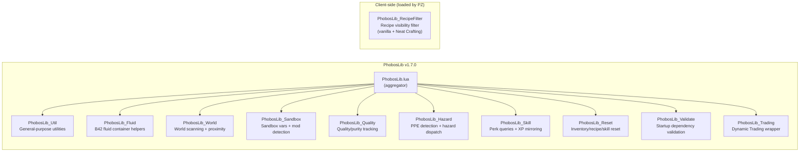

# PhobosLib Module Overview & API Reference

PhobosLib v1.7.0 provides 11 modules (10 shared + 1 client) loaded via `require "PhobosLib"` plus PZ's automatic client/ loading.

## Module Architecture



> The 10 shared modules load into the global `PhobosLib` table via `require "PhobosLib"`. The RecipeFilter module is loaded separately by PZ from `client/` and also attaches to the `PhobosLib` table.

---

## PhobosLib_Util

General-purpose utilities: safe method calling, API probing, keyword-based item search, modData helpers, and player speech bubbles.

| Function | Parameters | Description |
|----------|-----------|-------------|
| `lower(s)` | `s: string` | Safe lowercase conversion; returns `""` for nil/non-string |
| `pcallMethod(obj, methodName, ...)` | `obj, methodName, ...args` | Safe method call via pcall; returns `ok, result` |
| `probeMethod(obj, methodNames)` | `obj, methodNames: table` | Try multiple method names; returns first numeric result |
| `probeMethodAny(obj, methodNames)` | `obj, methodNames: table` | Try multiple method names; returns first non-nil result |
| `matchesKeywords(item, keywords)` | `item, keywords: table` | Check if item's fullType or displayName contains any keyword |
| `findItemByKeywords(inventory, keywords)` | `inventory, keywords: table` | Find first matching item in an inventory |
| `findAllItemsByKeywords(inventory, keywords)` | `inventory, keywords: table` | Find all matching items in an inventory |
| `findItemByFullType(inventory, fullType)` | `inventory, fullType: string` | Find item by exact fullType |
| `findAllItemsByFullType(inventory, fullType)` | `inventory, fullType: string` | Find all items matching exact fullType |
| `say(player, msg)` | `player, msg: string` | Safe player speech bubble; no-op if unavailable |
| `getItemWeight(item)` | `item` | Safe weight getter; probes getActualWeight then getWeight |
| `getItemUseDelta(item)` | `item` | Safe UseDelta getter for Drainable items |
| `setItemUseDelta(item, value)` | `item, value: number` | Safe UseDelta setter; clamps to [0, 1] |
| `refundItems(items, player)` | `items: ArrayList, player` | Re-add consumed recipe items to player inventory |
| `getItemCondition(item)` | `item` | Safe item condition getter |
| `setItemCondition(item, value)` | `item, value: number` | Safe item condition setter |
| `getModData(item)` | `item` | Safe modData table getter; returns table or nil |
| `getModDataValue(item, key, default)` | `item, key: string, default` | Read single modData value with fallback |
| `setModDataValue(item, key, value)` | `item, key: string, value` | Write single modData value; returns true on success |

---

## PhobosLib_Fluid

Build 42 fluid container helpers with multi-strategy API fallbacks.

| Function | Parameters | Description |
|----------|-----------|-------------|
| `tryGetFluidContainer(item)` | `item` | Get fluid container from an item; tries multiple method names |
| `tryGetCapacity(fc)` | `fc: FluidContainer` | Probe container capacity in litres |
| `tryGetAmount(fc)` | `fc: FluidContainer` | Probe current fluid amount in litres |
| `tryAddFluid(fc, fluidType, liters)` | `fc, fluidType, liters: number` | Add fluid using multiple strategies |
| `tryDrainFluid(fc, liters)` | `fc, liters: number` | Drain/remove fluid from container |

---

## PhobosLib_World

World scanning: tile iteration, object keyword search, generator detection, vehicle proximity.

| Function | Parameters | Description |
|----------|-----------|-------------|
| `getSquareFromPlayer(player)` | `player` | Safely get the IsoGridSquare a player is on |
| `scanNearbySquares(originSquare, radius, callback)` | `square, radius: number, callback: function` | Iterate all grid squares within radius |
| `findNearbyObjectByKeywords(originSquare, radius, keywords)` | `square, radius, keywords: table` | Find first matching IsoObject nearby |
| `findAllNearbyObjectsByKeywords(originSquare, radius, keywords)` | `square, radius, keywords: table` | Find all matching IsoObjects nearby |
| `isNearObjectType(player, radius, keywords)` | `player, radius, keywords: table` | Boolean: is player near a matching object? |
| `findNearbyGenerator(square, radius)` | `square, radius: number` | Find an active IsoGenerator nearby |
| `findAnyNearbyGenerator(square, radius)` | `square, radius: number` | Find any IsoGenerator nearby (running or not) |
| `findNearbyVehicle(player, radius)` | `player, radius: number` | Find nearest vehicle within radius |
| `isVehicleRunning(vehicle)` | `vehicle` | Safe check if vehicle engine is running |

---

## PhobosLib_Sandbox

Safe sandbox variable access, runtime mod detection, and yield scaling.

| Function | Parameters | Description |
|----------|-----------|-------------|
| `getSandboxVar(modId, varName, default)` | `modId, varName: string, default` | Retrieve sandbox variable with fallback |
| `isModActive(modId)` | `modId: string` | Check if a mod is in the active mod list |
| `applyYieldMultiplier(baseAmount, modId, varName)` | `baseAmount: number, modId, varName: string` | Scale amount by a sandbox multiplier variable |
| `setSandboxVar(modId, varName, value)` | `modId, varName: string, value` | Set a sandbox variable value (for one-shot auto-reset) |
| `consumeSandboxFlag(modId, varName)` | `modId, varName: string` | Clear sandbox flag in-memory AND persist to world modData for restart survival |
| `reapplyConsumedFlags()` | *(none)* | Re-apply consumed flags from world modData on game start (auto-registered via OnGameStart) |
| `createCallbackTable(name)` | `name: string` | **DEPRECATED v1.5.0** — craftRecipe OnTest is execution-only, not visibility. Use `registerRecipeFilter()` instead |
| `registerOnTest(tableName, funcName, func)` | `tableName, funcName: string, func: function` | **DEPRECATED v1.5.0** — craftRecipe OnTest is execution-only, not visibility. Use `registerRecipeFilter()` instead |

---

## PhobosLib_Quality

Generic quality/purity tracking: 0-100 scoring, tier lookup, equipment factors, severity scaling.

| Function | Parameters | Description |
|----------|-----------|-------------|
| `getQuality(item, key, default)` | `item, key: string, default: number` | Read quality value from item modData |
| `setQuality(item, key, value)` | `item, key: string, value: number` | Write clamped 0-100 quality value |
| `getQualityTier(value, tiers)` | `value: number, tiers: table` | Look up tier name and RGB colour |
| `averageInputQuality(items, key, default)` | `items: ArrayList, key, default` | Average quality across recipe inputs |
| `calculateOutputQuality(inputQuality, factor, variance)` | `input, factor, variance: number` | Calculate output quality with equipment factor |
| `randomBaseQuality(min, max)` | `min, max: number` | Generate random base quality for source recipes |
| `adjustFactorBySeverity(factor, severity)` | `factor, severity: number` | Adjust equipment factor by severity setting |
| `announceQuality(player, value, tiers, prefix)` | `player, value, tiers, prefix` | Speech bubble showing quality tier |
| `getQualityYield(value, yieldTable)` | `value: number, yieldTable: table` | Look up yield multiplier from quality |
| `applyFluidQualityPenalty(result, value, yieldTable)` | `result, value, yieldTable` | Drain fluid based on quality penalty |
| `removeExcessItems(player, itemType, baseCount, keepCount)` | `player, itemType, base, keep` | Remove excess items for yield penalties |
| `stampAllOutputs(player, resultType, key, value)` | `player, resultType, key, value` | Stamp quality on all unstamped outputs |

---

## PhobosLib_Hazard

PPE detection, respiratory protection assessment, mask filter degradation, EHR disease dispatch with vanilla stat fallback.

| Function | Parameters | Description |
|----------|-----------|-------------|
| `findWornItem(player, itemTypes)` | `player, itemTypes: table` | Scan worn items for matching full type |
| `getRespiratoryProtection(player)` | `player` | Returns `{hasMask, hasFilter, maskItem, protectionLevel}` |
| `degradeFilterFromInputs(items, maskTypes, amount)` | `items: ArrayList, maskTypes: table, amount: number` | Degrade mask filter found in recipe inputs |
| `isEHRActive()` | *(none)* | Check if EHR mod is active with disease system enabled |
| `applyHazardEffect(player, config)` | `player, config: table` | Dispatch EHR disease or vanilla stat penalties |
| `warnHazard(player, msg)` | `player, msg: string` | Speech bubble warning about hazard exposure |

### `applyHazardEffect` Config Table

| Field | Type | Description |
|-------|------|-------------|
| `ehrDisease` | string | EHR disease ID (e.g., `"corpse_sickness"`) |
| `ehrChance` | number | Base chance 0.0-1.0 |
| `ehrSevereDisease` | string? | Rare severe disease (e.g., `"pneumonia"`) |
| `ehrSevereChance` | number? | Chance for severe outcome |
| `vanillaSickness` | number | Vanilla SICKNESS stat delta |
| `vanillaPain` | number | Vanilla PAIN stat delta |
| `vanillaStress` | number | Vanilla STRESS stat delta |
| `protectionMultiplier` | number | 0.0-1.0, scales all chances |

---

## PhobosLib_Skill

Perk existence checks, safe XP queries and awards, one-shot XP mirroring, persistent cross-skill XP mirror registration.

| Function | Parameters | Description |
|----------|-----------|-------------|
| `perkExists(perkName)` | `perkName: string` | Check if a named perk exists in the Perks table |
| `getPerkLevel(player, perkEnum)` | `player, perkEnum` | Safe perk level query; returns 0-10 or 0 on failure |
| `addXP(player, perkEnum, amount)` | `player, perkEnum, amount: number` | Safe XP award; returns true on success |
| `getXP(player, perkEnum)` | `player, perkEnum` | Safe XP total query; returns 0 on failure |
| `mirrorXP(player, targetPerkEnum, amount, ratio)` | `player, target, amount, ratio: number` | One-shot XP mirror (no event hook) |
| `registerXPMirror(sourcePerkName, targetPerkName, ratio)` | `source, target: string, ratio: number` | Register persistent Events.AddXP mirror with reentrance guard |

---

## PhobosLib_Reset

Generic inventory/recipe/skill reset utilities for mod cleanup systems. Deep inventory traversal, modData stripping, recipe removal, XP reset, and item removal by module.

| Function | Parameters | Description |
|----------|-----------|-------------|
| `iterateInventoryDeep(player, callback)` | `player, callback: function` | Deep inventory traversal including nested containers (bags, backpacks), with visited-set loop guard |
| `stripModDataKey(player, key)` | `player, key: string` | Remove a specific modData key from all items (deep scan) |
| `forgetRecipesByPrefix(player, prefix)` | `player, prefix: string` | Two-pass recipe removal to avoid ConcurrentModificationException |
| `resetPerkXP(player, perkEnum)` | `player, perkEnum` | Multi-strategy XP reset (setXP → setPerkLevel → LoseLevel loop) |
| `removeItemsByModule(player, moduleId)` | `player, moduleId: string` | Remove all items belonging to a module, matching via getModule() or fullType prefix |
| `getWorldModDataValue(key, default)` | `key: string, default` | Read a value from the global world modData table with fallback |
| `stripWorldModDataKeys(prefix)` | `prefix: string` | Remove all world modData keys matching a prefix |

---

## PhobosLib_Validate

Startup dependency validation: register expected items, fluids, and perks at load time, then validate during OnGameStart. Missing entries are logged with the requesting mod ID.

| Function | Parameters | Description |
|----------|-----------|-------------|
| `expectItem(modId, fullType)` | `modId, fullType: string` | Register an expected item type to be verified at startup |
| `expectFluid(modId, fluidType)` | `modId, fluidType: string` | Register an expected fluid type to be verified at startup |
| `expectPerk(modId, perkName)` | `modId, perkName: string` | Register an expected perk to be verified at startup |
| `validateDependencies()` | *(none)* | Run all registered validations and log results; called automatically via OnGameStart |

### Usage Pattern

```lua
-- In your mod's shared/ init file (runs before OnGameStart):
local PL = require "PhobosLib"
PL.expectItem("MyMod", "Base.SomeItem")
PL.expectFluid("MyMod", "SomeFluid")
PL.expectPerk("MyMod", "SomePerk")

-- PhobosLib automatically calls validateDependencies() during OnGameStart.
-- Missing entries appear in console.txt as:
--   [PhobosLib:Validate] MISSING item 'Base.SomeItem' expected by MyMod
```

---

## PhobosLib_Trading

Generic wrapper for the Dynamic Trading mod (DynamicTradingCommon). All functions are no-ops when DynamicTrading is not installed. All DT calls are pcall-wrapped for safety if the mod is removed mid-save. Detection is lazy: the first call to any function checks whether the DynamicTrading global exists.

| Function | Parameters | Description |
|----------|-----------|-------------|
| `isDynamicTradingActive()` | *(none)* | Lazy runtime detection; returns `true` if DynamicTrading API is available |
| `registerTradeTag(tag, data)` | `tag: string, data: table` | Register a custom price/rarity tag; data = `{ priceMult = number, weight = number }` |
| `registerTradeArchetype(id, data)` | `id: string, data: table` | Register an NPC trader archetype; data = `{ name, allocations, wants, forbid }` |
| `registerTradeItems(list)` | `list: table` | Batch item registration; list = array of `{ item, basePrice, tags, stockRange }` — returns `ok, count` |
| `registerTradeItem(uniqueID, data)` | `uniqueID: string, data: table` | Single item registration; data = `{ item, basePrice, tags, stockRange }` |

### Usage Pattern

```lua
require "PhobosLib"

local function registerMyTradeData()
    if isClient() then return end
    if not PhobosLib.isDynamicTradingActive() then return end

    PhobosLib.registerTradeTag("MyTag", { priceMult = 1.5, weight = 20 })

    PhobosLib.registerTradeArchetype("MyMod_Trader", {
        name = "Specialist",
        allocations = { MyTag = 80, Common = 20 },
        wants = { MyTag = 1.3 },
        forbid = { "Illegal" },
    })

    PhobosLib.registerTradeItems({
        { item = "MyMod.ItemA", basePrice = 50, tags = { "MyTag", "Uncommon" }, stockRange = { min = 1, max = 3 } },
        { item = "MyMod.ItemB", basePrice = 20, tags = { "MyTag", "Common" }, stockRange = { min = 2, max = 6 } },
    })
end

Events.OnGameStart.Add(registerMyTradeData)
```

---

## PhobosLib_RecipeFilter

Client-side crafting menu recipe visibility filter. B42 `craftRecipe` `OnTest` is a server-side execution gate, NOT a UI visibility gate — `getOnAddToMenu()` returns nil for all craftRecipe objects. This module fills the gap by overriding the crafting UI to inject filter checks.

Supports three UI code paths:
- **Path 1**: Vanilla `ISRecipeScrollingListBox:addGroup()` (list view)
- **Path 2**: Vanilla `ISTiledIconPanel:setDataList()` (grid view)
- **Path 3**: Neat Crafting `NC_FilterBar:shouldIncludeRecipe()` — runtime-detected, installed immediately or deferred via `Events.OnGameStart`

> **Note**: This module lives in `client/` (not `shared/`) and is loaded automatically by PZ's client-side module loader, not by the PhobosLib aggregator.

| Function | Parameters | Description |
|----------|-----------|-------------|
| `registerRecipeFilter(recipeName, filterFunc)` | `recipeName: string, filterFunc: function` | Register a visibility filter for a single recipe; filter receives no args, returns `true` to show, `false` to hide |
| `registerRecipeFilters(filterTable)` | `filterTable: table` | Bulk-register from `{ ["RecipeName"] = filterFunc, ... }` table |
| `_checkRecipeFilter(recipeName)` | `recipeName: string` | Internal: check filter registry for a recipe name; pcall-wrapped, fail-open (returns `true` on error) |

### Usage Pattern

```lua
-- In your mod's client/ init file:
require "PhobosLib"

PhobosLib.registerRecipeFilter("MyModRecipeName", function()
    return SandboxVars.MyMod.EnableFeature
end)

-- Or bulk register:
PhobosLib.registerRecipeFilters({
    ["MyRecipeA"] = function() return SandboxVars.MyMod.OptionA end,
    ["MyRecipeB"] = function() return SandboxVars.MyMod.OptionB end,
})
```
